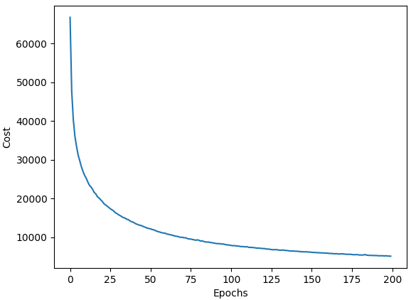
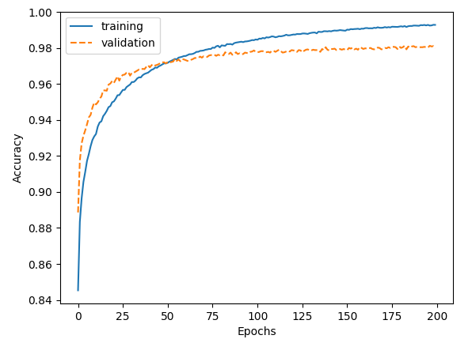
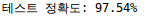
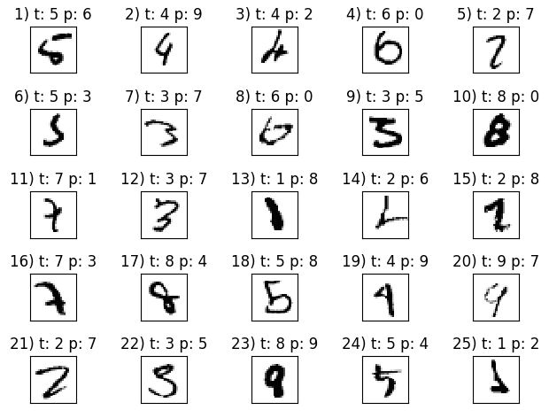

## 12.1 인공 신경망으로 복잡한 함수 모델링

#### 단일층 신경망 요약

* 2진 분류를 수행하는 아달린 알고리즘 구현

  * 

  * 경사하강법 최적화 알고리즘을 사용하여 모델 가중치를 학습했으며, epoch마다 가중치 벡터w를 업데이트하기위해 다음 공식을 사용하였다.

    * $w:=w+\Delta w$,여기서 $\Delta w = -\eta \bigtriangledown J(w)$

  * 최적의 모델 가중치를 찾기위해 제곱오차(SSE) 비용함수 J(w)로 정의된 목적 함수를 최적화 한다.

  * 경사 하강법 최적화에서는 epoch마다 모든 가중치를 동시에 업데이트한다.

    * $$
      \frac{\delta}{\delta w_j}J(w) = -\sum_i(y^{(i)} - a^{(i)})x_j^{(i)}
      $$

  * $a^{(i)}$는 활성화 출력이고, 아달린은 선형함수를 사용하므로 활성화함수 $\phi(z) = z = a$ 이다.

  * 최종 입력 $z$는 입력층과 출력층을 연결하는 선형 결합이므로 $z =\sum_j w_j x_j = w^Tx$ 이다.

  * 예측된 연속적인 출력값은 이진클래스로 구현되므로 $\hat y=\begin{cases}1 & \mbox{g(z) }  \ge \mbox{0일 때} \\ -1 & \mbox{그 외}\end{cases}$ 로 압축한다.

#### 다층 신경망 구조

* 다층 퍼셉트론(MLP)
  * 
  * 입력층, 은닉층, 출력층으로 구분되어 있다.
    * 하나 이상의 은닉층을 가진 네트워크를 심층 인공 신경망(deep artificial neural network)라고 한다.
  * one-hot encoding 기법을 사용하여 고유한 클래스 레이블 개수에 구애받지 않고 분류문제를 해결할 수 있다.

#### 정방향 계산으로 신경망 활성화 출력 계산

* MLP의 forward propagation 3단계 학습 과정

  1.  입력층에서 시작해서 정방향으로 훈련 데이터의 패턴을 네트워크에 전파하여 출력을 만든다.
  2. 네트워크의 출력을 기반으로 비용함수를 이용하여 최소화해야할 오차를 계산한다.
  3. 모델의 모든 가중치에 대한 오차를 역전파하고 모델을 업데이트한다.

* 활성화 함수는 그래디언트 기반 방식을 사용하여 뉴런과 연결된 가중치를 학습하기 위해 미분이 가능해야하고, 이미지 분류와 같은 복잡한 문제를 해결하기 위해서는 MLP 모델에 비선형 활성화 함수를 사용해야한다.

  * 그 예로, 시그모이드 활성화 함수를 사용한다.

  * $$
    \phi(z) = \frac{1}{1 + e^{-z}}
    $$

  * 

* 계산 비용이 비싼 파이썬의 for 반복문을 중복하여 사용하지 않고 넘파이를 사용하여 활성화 출력을 하기까지 넘파이를 활용한 벡터화 구현 및 행렬 계산을 진행할 수 있다.

  * $$
    \begin{matrix}
    z^{h} = a^{in}W^h && (1)\\
    a^h = \phi(z^h) && (2)\\
    \\Z^h = A^{in}W^h && (3)\\
    A^h = \phi(Z^h) && (4)\\
    Z^{out} = A^hW^{out} && (5)\\
    A^{out} = \phi(Z^{out}), A^{out} \in \mathbb{R}^{\mathsf{nxt}} && (6)
    \end{matrix}
    $$

    * (1)에서 $a^{in}$은 샘플 $x^{in}$에 절편을 더한 1xm차원 특성 벡터이고,  $W^h$는 mxd차원의 가중치 행렬이다.
    * (2)에서 1xd 차원의 $z^h$ 벡터로 활성화 출력 $a^h$가 계산되고, 훈련 세트에 있는 모든 n개의 샘플에 대하여 일반화 한 것이 (3)과 같다.
    * (3)에서 $A^{in}$은 nxm행렬이며, $Z^h$는 nxd차원의 최종 입력 행렬이다.
    * (4)에서 최종 입력에 활성화 함수를 적용하여 nxd차원의 $A^h$가 얻어진다.
    * (5)에서는 출력층의 활성화도 여러 샘플에 대한 벡터로 표현된 것으로, nxd차원의 $A^h$와 dxt차원의 $W^{out}$을 곱해 nxt차원의 $Z^{out}$이 얻어진다.
    * (6)에서 마지막으로 시그모이드 활성화 함수를 적용하여 실수로 된 네트워크 출력을 얻을 수 있다.


## 12.2 MNIST 분류

#### MNIST 데이터셋 구하기

* http://yann.lecun.com/exdb/mnist/ 에 공개되어 있으며 총 4부분으로 구성되어 있다.

  * training set images, training set labels, test set images, test set labels

* ```python
  def load_mnist(path, kind='train'):
      labels_path = os.path.join(path, '%s-labels-idx1-ubyte' %kind)
      images_path = os.path.join(path, '%s-images-idx3-ubyte' %kind)
  
      with open(labels_path, 'rb') as lbpath:
          magic, n = struct.unpack('>II', lbpath.read(8))
          labels = np.fromfile(lbpath, dtype=np.uint8)
  
      with open(images_path, 'rb') as imgpath:
          magic, num, rows, cols = struct.unpack('>IIII', imgpath.read(16))
  
          images = np.fromfile(imgpath, dtype=np.uint8).reshape(len(labels), 784)
          images = ((images / 255.) - .5) * 2
  
      return images, labels
  ```

  * 파일 다운후, load_mnist 함수를 통하여 kind에 따라 train과 test 샘플의 image와 label을 가져올 수 있다.

  * 

  * .npz 파일로 각 샘플을 save와 load도 구현 될 수 있다.

    * ```python
      def save_n_load(X_train, y_train, X_test, y_test):
          x_tr = X_train[:55000]
          x_val = X_train[55000:]
          y_tr = y_train[:55000]
          y_val = y_train[55000:]
          x_ts = X_test
          y_ts = y_test
          np.savez_compressed('mnist_scaled.npz', X_train=x_tr, y_train=y_tr, X_valid=x_val, y_valid=y_val, X_test=x_ts, y_test=y_ts)
      
          mnist = np.load('mnist_scaled.npz')
          print(mnist.files)
          X_train, y_train, X_valid, y_valid, X_test, y_test = [mnist[f] for f in mnist.files]
          print(X_train.shape, y_train.shape, X_valid.shape, y_valid.shape, X_test.shape, y_test.shape)
      ```

  * mnist의 파일은 train 60000, test 10000개로 이루어져 있다.

#### 다층 퍼셉트론 구현

* ```python
  import numpy as np
  import sys
  
  class NeuralNetMLP(object):
  
      def __init__(self, n_hidden=30, l2=0, epochs=100, eta=0.001,
                   shuffle=True, minibatch_size=1, seed=None):
  
          self.random = np.random.RandomState(seed)
          self.n_hidden = n_hidden
          self.l2 = l2
          self.epochs = epochs
          self.eta = eta
          self.shuffle = shuffle
          self.minibatch_size = minibatch_size
  
      def _onehot(self, y, n_classes):
  	## label을 one-hot 방식으로 인코딩
          onehot = np.zeros((n_classes, y.shape[0]))
          for idx, val in enumerate(y.astype(int)):
              onehot[val, idx] = 1
          return onehot.T
  
      def _sigmoid(self, z):
          return 1./(1. + np.exp(-np.clip(z, -250, 250)))
  
      def _forward(self, X):
  		## 1단계: 은닉층의 최종입력
          z_h = np.dot(X, self.w_h) + self.b_h
  		
          ## 2단계: 은닉층의 활성화 출력
          a_h = self._sigmoid(z_h)
  		
          ## 3단계: 출력층의 최종 입력
          z_out = np.dot(a_h, self.w_out) + self.b_out
  		
          ## 4단계: 출력층의 활성화 출력
          a_out = self._sigmoid(z_out)
  
          return z_h, a_h, z_out, a_out
  
      def _compute_cost(self, y_enc, output):
  		## 비용함수 계산
          ## y_enc: one-hot encoding 된 클래스 레이블
          ## output: 출력층의 활성화 출력(정방향 계산)
          
          L2_term = (self.l2 * (np.sum(self.w_h ** 2) + np.sum(self.w_out ** 2)))
  
          term1 = -y_enc * (np.log(output))
          term2 = (1. - y_enc) * np.log(1. - output)
          cost = np.sum(term1 - term2) + L2_term
          return cost
  
      def predict(self, X):
  
          z_h, a_h, z_out, a_out = self._forward(X)
          y_pred = np.argmax(z_out, axis=1)
          return y_pred
  
      def fit(self, X_train, y_train, X_valid, y_valid):
          # print(X_train.shape)
          n_output = np.unique(y_train).shape[0]
          n_features = X_train.shape[1]
  
          ##가중치 초기화##
          # 입력층 -> 은닉층 사이의 가중치
          self.b_h = np.zeros(self.n_hidden)
          self.w_h = self.random.normal(loc=0.0, scale=0.1, size=(n_features, self.n_hidden))
  
          # 은닉층 -> 출력층 사이의 가중치
          self.b_out = np.zeros(n_output)
          self.w_out = self.random.normal(loc=0.0, scale=0.1, size=(self.n_hidden, n_output))
  
          epoch_strlen = len(str(self.epochs))	## 출력 형식(print format) 맞추기
          self.eval_ = {'cost': [], 'train_acc': [], 'valid_acc': []}
  
          y_train_enc = self._onehot(y_train, n_output)
  
          # train epoch 반복
          for i in range(self.epochs):
  
              indices = np.arange(X_train.shape[0])
              if self.shuffle:
                  self.random.shuffle(indices)
  
              for start_idx in range(0, indices.shape[0] - self.minibatch_size + 1, self.minibatch_size):
                  batch_idx = indices[start_idx:start_idx+self.minibatch_size]
  
                  # forward propagation
                  z_h, a_h, z_out, a_out = self._forward(X_train[batch_idx])
  
                  # back propagation
                  sigma_out = a_out - y_train_enc[batch_idx]
                  sigmoid_derivative_h = a_h * (1. - a_h)
  
                  sigma_h = (np.dot(sigma_out, self.w_out.T) * sigmoid_derivative_h)
  
                  grad_w_h = np.dot(X_train[batch_idx].T, sigma_h)
                  grad_b_h = np.sum(sigma_h, axis=0)
  
                  grad_w_out = np.dot(a_h.T, sigma_out)
                  grad_b_out = np.sum(sigma_out, axis=0)
  
                  delta_w_h = (grad_w_h + self.l2*self.w_h)
                  delta_b_h = grad_b_h
                  self.w_h -= self.eta * delta_w_h
                  self.b_h -= self.eta * delta_b_h
  
                  delta_w_out = (grad_w_out + self.l2 * self.w_out)
                  delta_b_out = grad_b_out
                  self.w_out -= self.eta * delta_w_out
                  self.b_out -= self.eta * delta_b_out
  
              # evaluate
  			# 훈련하는 동안 에폭마다 평가
              z_h, a_h, z_out, a_out = self._forward(X_train)
  
              cost = self._compute_cost(y_enc=y_train_enc, output=a_out)
  
              y_train_pred = self.predict(X_train)
              y_valid_pred = self.predict(X_valid)
  
              train_acc = ((np.sum(y_train == y_train_pred)).astype(np.float) / X_train.shape[0])
              valid_acc = ((np.sum(y_valid == y_valid_pred)).astype(np.float) / X_valid.shape[0])
  
              sys.stderr.write('\r%0*d/%d | 비용: %.2f | 훈련/검증 정확도: %.2f%%/%.2f%% ' %
                               (epoch_strlen, i+1, self.epochs, cost, train_acc*100, valid_acc*100))
              sys.stderr.flush()
  
              self.eval_['cost'].append(cost)
              self.eval_['train_acc'].append(train_acc)
              self.eval_['valid_acc'].append(valid_acc)
  
          return self
  
  ```

* ```python
  nn = NeuralNetMLP(n_hidden=100, l2=0.01, epochs=200, eta=0.0005, minibatch_size=100, shuffle=True, seed=1)
  ```

  * 다음 코드를 통해 100개의 은닉층과 l2정규화의 $\lambda$=0.01, 에폭은 200, 학습률은 0.0005, 미니배치의 크기는 100 을 가진 MLP를 구현

* ```python
  nn.fit(X_train=X_train, y_train=y_train, X_valid=X_valid, y_valid=y_valid)
  ```

  * 다음 코드를 통해 55000개의 train set과 5000개의 validation set으로 학습 진행

* 

* 

* 

  * train/validation 정확도를 보았을 때, 약간의 과적합의 영향을 보여주고 있음을 알수 있다.
  
* ```python
  y_test_pred = nn.predict(X_test)
  acc = (np.sum(y_test == y_test_pred).astype(np.float) / X_test.shape[0])
  ```

* 

  *  test set의 정확도는 97.54%로 validation set의 정확도와 비슷하게 나왔음을 알 수 있다.

* 과대적합 영향을 줄이는 방법으로 규제 강도를 높이는것으로 제시되어 있다.

  * l2=0.1로 설정
  * 
  * 
    * 과대적합의 영향의 줄어듬을 확인할 수 있는 반면, test set의 정확도는 1%가량 줄어들었다.
  * 규제 강도의 변화 이외에도 학습률, 에폭수, 은닉층의 수 등등으로 세밀한 튜닝 방법이 있으며, 다양한 최적화 기법들(Adam, Momentum, ..)과 드롭아웃 적용 또한 신경망 구조 내에서 좋은 성능을 내기위한 방법들도 있다.

* 

  * 틀리게 예측한 것들의 sample 25개 표시