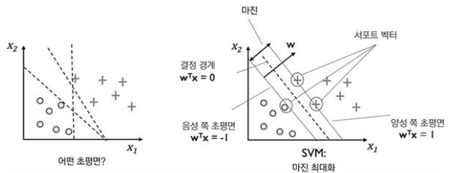
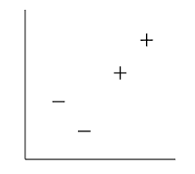
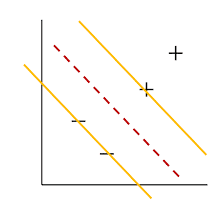
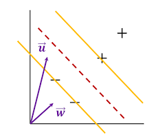
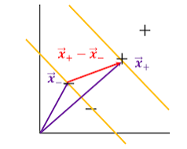
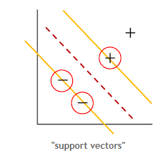
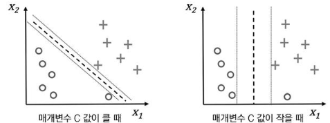
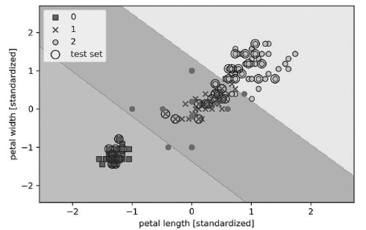

## Ch 3.4 서포트 벡터 머신을 사용한 최대 마진 분류

* SVM(Support vector machine)
  * 분류나 회귀 분석에 사용이 가능하며, 특히 분류 쪽의 성능이 뛰어나기 때문에 주로 분류에 많이 사용 되는 지도 학습 알고리즘이며, 초평면(hyper-plane)을 이용해 카테고리를 나누는 알고리즘.
* SVM의 최적화 대상
  * 마진을 최대화 하는것
* 마진
  * 클래스를 구분하는 초평면(결정 경계)과 이 초평면에 가장 가까운 훈련 샘플 사이의 거리를 정의
* 

### Ch 3.4.1 최대 마진

* Surpport Vector Machine

> "How do we divide the space with decision boundaries?"
>
> '+'와 '-' 샘플 사이의 거리를 가장 넓게 쓰는 어떤 Line

​																	

> decision boundary를 정하기 위한 decision rule은 어떤 형태여야 할 것인가?


$$
\vec{w}\;:\;점선과\;수직\quad \vec{u}\;:\;임의의\;샘플\quad c\;:\;어떤\;상수\\
\vec{w} \cdot \vec{u} \ge c\\
일반성을\;해치지\;않는\;범위에서 \Rightarrow \vec{w} \cdot \vec{u} + b \ge 0 \qquad then '+' \qquad \qquad (1)\\
$$

$$
'+'샘플의\;경우\;decision\;rule이\;최소한\;1보다\;큰\;값을\;주도록\;한다.(constraint)\\
\vec{w} \cdot \vec{x_+} + b \ge 1\\
\vec{w} \cdot \vec{x_-} + b \le -1\\
$$


$$
수학적\;편리성을\;위해\;y\;추가\\
y=\begin{cases}
1 & \mbox{for '+'}\\
-1 & \mbox{for '-'}
\end{cases}\\
y_i \left(\vec{w} \cdot \vec{x_i} + b \right) \ge 1\\
y_i \left(\vec{w} \cdot \vec{x_i} + b \right) -1 \ge 0 \qquad \qquad (2)\\
$$

$$
등호\;성립\;시\;\vec{x_i}가\;street의\;양쪽\;노란\;경계선에\;정확히\;걸쳐있다.(constraint)\\
y_i \left(\vec{w} \cdot \vec{x_i} + b \right) -1 =0 \qquad for \;\vec{x_i} \in노란선(gutters) \qquad \qquad (3)\\
$$



$$
WIDTH=(x_+-x_-)\cdot \frac{\vec{w}}{\lVert \vec{w} \rVert}\\
이때, 식(3)을\;통해\;(x_+-x_-)\cdot \vec{w} = 2를\;도출할\;수\;있으므로\\
WIDTH=\frac{2}{\lVert \vec{w} \rVert}\qquad \qquad(4)\\
max \frac{1}{\lVert \vec{w} \rVert} \leftrightarrow min\lVert \vec{w} \rVert \leftrightarrow min \frac{1}{2}\lVert \vec{w} \rVert^2 \\
$$

> Lagrange Multiplier Method(라즈랑주 승수법)
>
> > 문제를 해결함에 있어 수식(3)의 제약 조건을 만족시켜야 하는데, 등식 제약조건이 있는 최적화 문제는 다양하게 연구되어 왔지만 라즈랑주 승수법을 적용하면 제약 조건을 신경쓰지 않고 풀수 있도록 문제를 바꿀 수 있다.

$$
\mathcal{L}(w,b,\alpha)=\frac{1}{2}\lVert \vec{w} \rVert^2 - \sum_{i=1}^N{\alpha_i[y_i(\vec{w} \cdot \vec{x_+} + b) - 1]} \qquad \qquad (5)\\
minimize \quad w.r.t. \quad \vec{w}\;and\;b \qquad w.r.t. \quad \alpha_i \ge 0 \quad \forall_i \quad (\alpha:Lagrange\;multiplier)\\
$$

$$
우리가\; 관심있는\; 각각의\; 변수에\; 대해\; 미분을\; 해주면\; 다음\; 식들을\; 얻을\; 수\; 있습니다.\\
\vec{w}에\;대한\;미분)\;\;\nabla_\vec{w}\mathcal{L}=\vec{w}-\sum_i\alpha_i y_i \vec{x_i} = 0 \qquad \qquad (6)\\
\Rightarrow \vec{w} = \sum_i\alpha_i y_i \vec{x_i}\\
\Rightarrow decision\; \vec{w}가\;'some'샘플들의\;선형\;합으로\;나타낼\;수\;있다.\\
b에\;대한\;미분)\;\;\nabla_b \mathcal{L}=-\sum_i\alpha_i y_i = 0 \qquad \qquad (7)
$$


$$
\begin{matrix}
\sum_{i=1}^N \alpha_i + \frac{1}{2}\lVert \vec{w} \rVert^2 - \sum_{i=1}^N{\alpha_i y_i \vec{w}^T\vec{x_i}}
&\iff & \sum_{i=1}^N \alpha_i + \frac{1}{2}\vec{w}^T\vec{w} - \vec{w}^T\vec{w}\\
&\iff & \sum_{i=1}^N \alpha_i - \frac{1}{2}\vec{w}^T\vec{w}\\
&\iff & \sum_{i=1}^N \alpha_i - \frac{1}{2}\sum_{i=1}^N \sum_{j=1}^N \alpha_i \alpha_j y_i y_j \vec{x}_i^T\vec{x}_j\\
&\iff& \mathcal{L}(\alpha).
\end{matrix}\\
$$


* alpha를 구하면, w백터를 구할 수 있게 되고, 이어서 식(3)의 b도 구할 수 있게 됩니다.
* 식(3)에 의해 alpha 값이 0이 아니라는 것은 해당 x백터가 경계선을 정하는 샘플이라는 뜻이고, SVM에서는 이런 샘플들을 "support vector" 라고 부른다.

### ch 3.4.2 슬랙 변수를 사용하여 비선형 분류 문제 다루기

* 슬랙 변수
  * 선형적으로 구분되지 않는 데이터에서 선형 제약 조건을 완화할 필요가 있기 때문에 도입
  * 이를 통해 적절히 비용을 손해 보면서 오차가 있는 상황에서 최적화 알고리즘이 수렴

* 제약조건

  $$
w_0+w^Tx^{1}\ge 1-\xi^{(i)} \;\qquad y^{(i)}=1 일때\\
  w_0+w^Tx^{1}\le -1+\xi^{(i)} \qquad y^{(i)}=-1 일때\\
  i=1 \cdot\cdot\cdot N\;까지 \qquad N은\;데이터셋에\;있는\;샘플\;개수\\
  $$
  
  * 클래스에 속하는 데이터가 +(또는 - ) 평면보다 슬랙변수 만큼 아래(또는 윗) 부분에 존재할 수 있도록 허용하게 된다.
  
  * 따라서, 슬랙변수 값이 클수록 더 심한 오차분류를 허용함을 의미하며 분류조건을 통합하여 나타낸 식은 다음과 같다.
  
  * $$
    y_i \left( w^Tx_i + x_0\right) \ge 1-\xi_i\\
    \xi_i \ge 0
    $$
  
* 최소화할 새로운 목적 함수

  * 분류조건을 만족하고 마진을 최대화 하는 파라미터를 찾기위해 목적함수는 다음과 같이 정의
  
  * $$
  J(w,\xi) = \frac{1}{2} \lVert w \rVert^2 + C \left( \sum_i \xi^{(i)}\right)
    $$

  * 슬랙변수에 의존하는 항은 슬랙변수 값을 되도록 최소화하여 오분류의 허용도를 낮추기 위해 추가되었다.

  * C는 최소화 조건을 반영하는 정도를 결정하는 값으로 사용자가 적절히 정해주어야 한다.

    * C 값이 크면 오차에 대한 비용이 커진다. 즉, C 값이 크면 허용 오차의 개수가 작아진다.

  * 
  
    https://gentlej90.tistory.com/44
  
    
  
  * 붓꽃 데이터셋의 꽃 분류문제에 SVM모델을 훈련
  
  * ```python
    from sklearn.svm import SVC
    svm = SVC(kernel='linear', C=1.0, random_state=1)
    svm.fit(X_train_std, y_train)
    plot_decision_regions(X_combined_std, y_combined, classifier=svm,
                         test_idx=range(105, 150))
    plt.xlabel('petal length [standardized]')
    plt.ylabel('petal width [standardized]')
    plt.legend(loc='upper left')
    plt.tight_layout()
    plt.show()
    ```
  
    


### ch 3.4.3 사이킷런의 다른 구현

* LogisticRegression클래스는 LIBLINEAR 라이브러리를 사용하고, SVM클래스는 LIBSVM을 사용한다.

* LIBLINEAR와 LIBSVM은 많은 선형 분류기를 아주 빠르게 훈련할 수 있는 장점이 있다. 반면, 데이터셋이 너무 커서 컴퓨터 메모리 용량에 맞지 않는 경우가 있다.

* SGDClassifier 클래스

  * 위의 단점에 대한 대안으로 제공

  * partial_fit 메서드를 사용하여 온라인 학습을 지원

  * 아달린을 위해 구현한 확률적 경사하강법과 비슷

  * 기본 매개변수를 사용한 퍼셉트론, 로지스틱 회귀, 서포트 벡터 머신의 확률적 경사하강법 버전
  
    * ```python
      from sklearn.linear_model import SGDClassifier
      ppn = SGDClassifier(loss='perceptron')
      lr = SGDClassifier(loss='log')
      svm = SGDClassifier(loss='hinge')
      ```